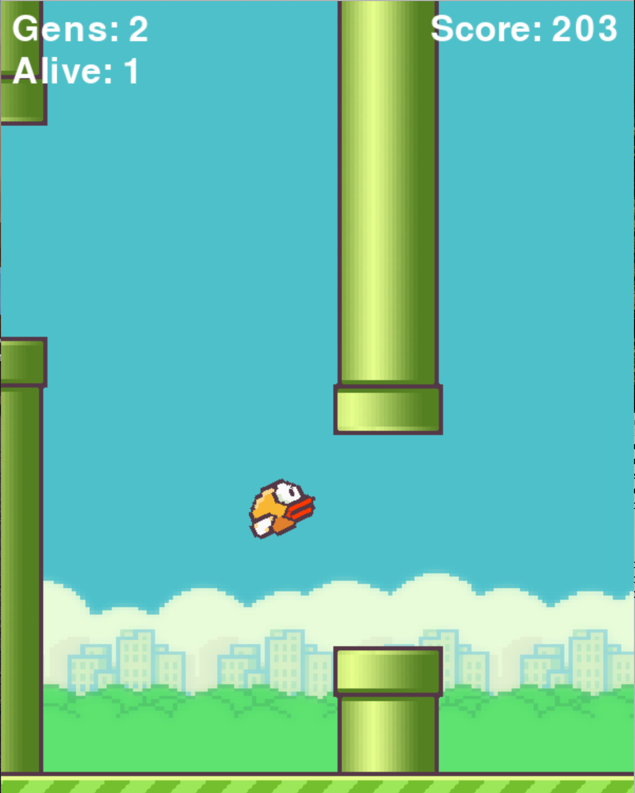

# Flappy-Bird-

Artificial Intelligence for Flappy Bird game using NEAT model. 

# NEAT (Neuro Evaluation of Augmented Topology)

Instead of relying on a fixed structure for a neural network, why not allow it to evolve through a genetic algorithm? 
Neat is a genatic Algorithm.

# Neural Network Parameters:

Inputs:
<ul>
<li>Position of bird </li>
<li>Distance of bird from pipe1</li>
<li>Distance of bird from pipe2</li>
</ul>

Output:
<ul>
<li>Jump</li>
<li>Not Jump</li>
</ul>

Activation Function: tanH() (squeeze the value between -1 to +1)

bais - Gaussian Distribution 

(For futher detalis of network refer config-feedforward.txt file)

# NEAT implementation:

<b>Population of bird</b>: We start with generation of 50 random birds. Each population is going to consist of bird and a neural network that controls each bird. 
<b>Neural Network</b>: It is going to start with <b>random weights and random biases </b>, then it will test for all the neural networks on our game and evaluate there <b>fitness</b>(How far the bird progressed in the level). Every frame it moves forward without dying it gets point which is <b>fitness score</b>. In the end, when all birds dies top performed birds will be selected based on the percentage of acceptance mentioned(2% for my case). Those selected birds will be breed and mutated to create brand new population of the bird.
  
# Output

The games continues till infity.
Scores after runing the game to 5-7 mintutes.  

